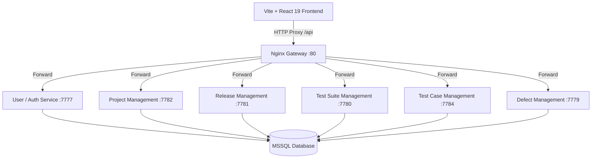

# QualityManager — High-Performance Test Management Platform

QualityManager is an enterprise-grade, open-source test management suite. It is built as a modular microservices monorepo utilizing a **React 19** frontend, **Node.js/Express** microservices, and **Microsoft SQL Server (MSSQL)** as the relational persistence layer, orchestrated via a **Nginx dynamic gateway**.

---

## 1. System Architecture

The platform operates on a decentralized, event-ready microservices model:



### Microservice Topology

| Port | Service Name | Purpose |
| :--- | :--- | :--- |
| `80` | **Gateway (Nginx)** | Single Entry point; dynamic proxy resolution and security gateway |
| `7777` | **User Services** | Authorization checks, user CRUD, group privileges, JWT issuing |
| `7779` | **Defect Services** | Bug tracking, status reporting, test case connections |
| `7780` | **TestSuite Services** | Grouping test scenarios into executable suites |
| `7781` | **Release Services** | Release timelines, version targets, suite attachment mappings |
| `7782` | **Project Services** | Core container scopes, project metadata |
| `7784` | **TestCase Services** | Detailed test steps, execution state, historical run logs |

---

## 2. Directory Layout

The codebase is organized as an NPM-workspaces powered monorepo:

```
QualityManager/
├── packages/
│   ├── Client/
│   │   └── TestManagementUI/    # Vite + React 19 Frontend Client
│   └── Services/                # Node.js + Express Backend Microservices
├── nginx.conf                   # Dynamic proxy resolver configuration
├── docker-compose.yml           # Unified multi-service local environment launcher
├── mock_data.sql                # Relational seed data for database
└── .env                         # Centralized environment configurations
```

---

## 3. Local Development Quickstart

### Prerequisites
* **Docker & Docker Compose** (highly recommended for dynamic multi-container hosting)
* **Node.js (v18+)**
* **MSSQL Client** (for database monitoring)

### Step 1: Clone and Set Up Environments
Ensure a `.env` file is present in the repository root. This file centralizes backend DB URLs, ports, JWT secrets, and dev bypass tokens:

```ini
DB_SERVER=sql-server
DB_USER=sa
DB_PASSWORD=Password@123
DB_NAME=QualityManager
PORT_USER_SERVICES=7777
PORT_PROJECT_MANAGEMENT=7782
PORT_RELEASE_MANAGEMENT=7781
PORT_TESTSUITE_MANAGEMENT=7780
PORT_TESTCASE_MANAGEMENT=7784
PORT_DEFECT_MANAGEMENT=7779
JWT_SECRET=supersecretdevkey
```

### Step 2: Spin Up the Stack via Docker
Deploy the database container, Nginx reverse proxy, and all microservices in a single command:
```bash
docker compose up -d --build
```
This builds each Node app, boots up the MSSQL server instance, mounts seed mappings, and configures the internal Docker bridge network seamlessly.

### Step 3: Run the Frontend Client Locally
Change to the client package, install dependencies, and run the development bundle:
```bash
cd packages/Client/TestManagementUI
npm install
npm run dev
```
Open `http://localhost:5173` in your browser. You can log in using the pre-seeded credentials:
* **Username:** `demo`
* **Password:** `demo123`

---

## 4. Sub-Package Documentation

To explore granular development details, setup pipelines, and testing suites, refer to the dedicated READMEs inside the monorepo packages:

* 🎨 **[Frontend UI Documentation](file:///c:/Users/Pranav/Documents/Code/git/QualityManager/packages/Client/TestManagementUI/README.md):** Detailed guide on Vite + React 19 structure, UI components/pages organization, and the Vitest Spec-Driven Development (SDD) runner.
* ⚙️ **[Backend Services API Manual](file:///c:/Users/Pranav/Documents/Code/git/QualityManager/packages/Services/readme.md):** Deep reference details on database schemas, Sequelize Sequelize-ORM dynamic mappings, and endpoint routing.
